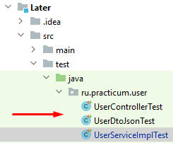
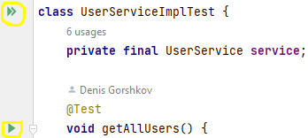

# Later

#### (от англ. "На потом")

### Приложение для сохранения полезных ссылок

###### Приложение разработано в рамках прохождения учебного курса [Java-разработчик от Яндекс.Практикум](https://practicum.yandex.ru/java-developer/)

***

## Идея

Его идея в том, чтобы собирать подборки полезных материалов и сохранять ссылки с разных устройств.
Например, вы дизайнер и читаете много контента по дизайну — приложение даст возможность создать
хранилище для лучших публикаций. Его можно использовать как самому, так и поделиться с другими
дизайнерами.

## Основа приложения

Приложение представляет собой микросервис в контейнере Docker. Может сохранять заголовки страницы и 
информацию о типе контента, который находится по этой ссылке: изображение, видео или что-то другое.
  _Предполагается, что Later работает со сторонним сервисом авторизации и аутентификации, 
который частично обрабатывает первоначальные запросы и дальше передает их в основной сервис._

## Функционал

Приложение позволяет выбрать действия для следующих категорий:

1) **пользователь**:

    - добавление нового пользователя (данные о новом пользователе передаются в теле запроса на
      эндпоинт `POST /users`)
    - получение списка всех пользователей (эндпоинт `GET /users`)

2) **ссылка**:

    - добавление новой ссылки (идентификатор пользователя передаётся в заголовке запроса
      `X-Later-User-Id`, данные о новой ссылке передаются в теле запроса на эндпоинт `POST /items`)
    - обновление информации о ссылке (на эндпоинт `PATCH /items/{itemId}?replaceTags=&unread=` 
      передаются: в заголовке запроса идентификатор пользователя `X-Later-User-Id`, в переменную 
      пути `{itemId}` идентификатор ссылки для обновления, в теле запроса список тэгов для 
      обновления информации о ссылке, в параметре запроса `?replaceTags=` - заменить тэги или 
      добавить новые к существующим (принимает значения `true` или `false`, по умолчанию `false`), 
      в параметре  запроса `unread=` - пометить как непрочитанную ссылку (принимает значения 
      `true` или `false`, по умолчанию `false`))
    - удаление ссылки (идентификатор пользователя передаётся в заголовке запроса
      `X-Later-User-Id`, идентификатор ссылки для удаления передаётся в переменную пути
      `{itemId}` на эндпоинт `DELETE /items/{itemId}`)
    - получение всех ссылок пользователя (на эндпоинт 
      `GET /items?state=&contentType=&sort=&limit=&tags=` передаются: идентификатор пользователя 
      в заголовке запроса `X-Later-User-Id`, в параметрах запроса `?state=` статус ссылок (по 
      умолчанию `state=unread`), `contentType=` тип контента страницы (по умолчанию 
      `contentType=all`), `sort=` тип сортировки ссылок (по умолчанию `sort=newest`), `limit=` 
      ограничение на количество выводимых результатов (по умолчанию `limit=10`), `tags=` список 
      тэгов для поиска ссылок (по умолчанию не требуется))
    - получение ссылок пользователя с проверкой их актуальности (идентификатор 
      пользователя передаётся в  заголовке запроса `X-Later-User-Id` на эндпоинт 
      `GET /items/status`)

## Стек технологий

 - *[Windows](https://www.microsoft.com/ru-ru/software-download/windows10) 10* - операционная
система
 - *[Java](https://www.java.com/ru/) 11* - язык программирования
 - *[IntelliJ IDEA](https://www.jetbrains.com/ru-ru/idea/download/?ysclid=l8l4s0cdro888284513#section=windows)
2022.1.4 (Ultimate Edition)* - среда разработки
 - *[Spring Boot](https://spring.io) 2.6.1* - используемый фреймворк
 - *[PostgreSQL](https://www.postgresql.org/) 13.7-alpine* - основная база данных
 - *[H2](https://ru.wikipedia.org/wiki/H2)* - база данных для тестирования
 - *[Apache Maven](https://maven.apache.org/) 4.0.0* - управление зависимостями
 - *[Project Lombok](https://projectlombok.org/) 1.18.24* - библиотека аннотаций для сокращения
шаблонного кода
 - *[Hibernate](https://hibernate.org/) 5.6.10* - ORM-фреймворк
 - *[Docker Desktop](https://docs.docker.com/desktop/install/windows-install/) 20.10.17* -
платформа контейнеризации
 - *[Docker Compose](https://docs.docker.com/compose/install/) 3.8* - утилита для
развертывания контейнеров
 - *[JUnit](https://junit.org) 4.13.2* - фреймворк для модульного тестирования программного
обеспечения на языке Java
 - *[Mockito](https://site.mockito.org/) 4.5.1* - фреймворк для тестирования программного
обеспечения
 - *[Postman](https://www.postman.com/downloads/) 9.31.0* - приложение для выполнения запросов
к API

## Шаблоны проектирования

В приложении использованы шаблоны проектирования Data Transfer Object (DTO Pattern) и Builder.

## Запуск приложения

На Вашем компьютере должны быть установлены соответствующие приложения из раздела ["Стек
технологий"](#стек-технологий).
Для запуска приложения необходимо:

- склонировать [проект](https://github.com/gorden73/Later) на свой компьютер
- запустить приложение _Docker_
- открыть склонированный проект в _IntelliJ IDEA_
- открыть терминал командной строки и вписать команду `mvn clean package`. Дождаться выполнения
  успешной сборки проекта.
- далее в терминал вписать команду `docker compose up` и дождаться успешного запуска сервиса
в контейнере _Docker_.

Для использования приложения необходимо открыть браузер или программу для
работы с API, например, [Postman](https://www.postman.com/).
 В адресной строке написать `https://localhost:8080/` и далее необходимый эндпоинт для
подходящего действия из раздела [Функционал](#функционал).

## Выполнение тестов

Написаны модульные тесты (выполняются в отдельной базе данных
[H2](https://ru.wikipedia.org/wiki/H2)).
 Чтобы пройти тесты достаточно открыть склонированный проект
в *[IntelliJ IDEA](https://www.jetbrains.com/ru-ru/idea/download/?ysclid=l8l4s0cdro888284513#section=windows)*
, перейти в директорию тестов `Later/src/test/java/ru.practicum.user` и выбрать из
предложенных интересующий класс для проверки (красная стрелка)
 
 Внутри класса можно запустить все тесты, которые есть в данном классе, нажав на двойной
зелёный треугольник слева от названия класса, или же запустить выполнение определенного теста, 
нажав на зелёный треугольник слева от названия теста.
 

## Автор

Связаться с автором проекта можно в [telegram](https://t.me/gorden73).

[Вернуться в начало](#later)